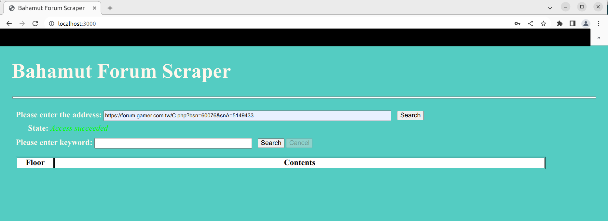
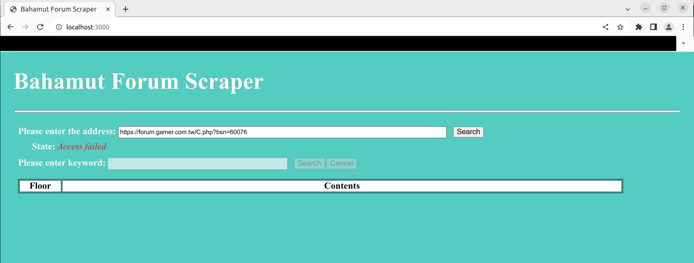
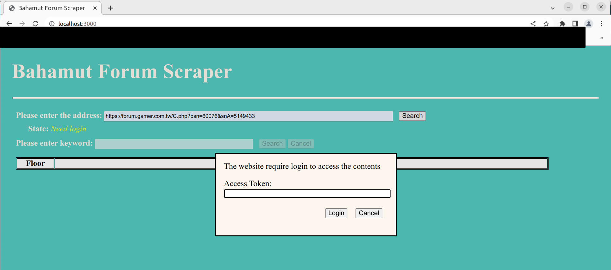

# 巴哈姆特討論串爬文器 (English README WIP)

## 描述
- 巴哈姆特還未支援限定單一討論串內的搜尋，倘若已經確定要搜尋某個討論串內的內容，必須要自己去過濾同一個哈拉版內其他討論串的結果
- 本爬文器透過帶入討論串的連結，可以搜尋僅限該討論串內的文章

## 前置條件
- (待完工)

## 如何使用
1. 在server.js所在的目錄打開命令提示字元/終端，輸入`node server.js`，之後會顯示``Server running at http://127.0.0.1:3000``

2. 在瀏覽器網址輸入`localhost:3000`或`127.0.0.1:3000`，即可進入爬文器網頁
3. 先輸入討論串網址，按下搜尋後會確認討論串是否存在，另外目前場外休憩區處於隱版狀態，必須要登入才能瀏覽，因此會需要額外的步驟，詳請請見此處(待完工)
   - 瀏覽成功

   - 瀏覽失敗

   - 需要登入

4. 當狀態顯示成功後，即可輸入關鍵字來搜尋符合的樓層(不輸入關鍵字則會顯示所有樓層內容)

5. 找到符合的樓層時，可以點選左側樓層的文字直接連結到該樓層

## 用cookie瀏覽場外休憩區
- 巴哈姆特目前的設計是以cookie儲存登入的token，藉以判定目前是登入還是未登入的狀態
- 倘若需要搜尋場外休憩區的討論串，在上面第三步完後，會跳出一個小視窗詢問你的登入token(本爬文器絕對不會記錄你的token)

### 如何獲取token
- Chrome
  1. 在巴哈姆特登入後，在任何巴哈的頁面的任一處滑鼠右鍵點一下，在跳出的選單中選擇**檢查(Inspect)**
  2. 接著會在頁面中跳出一排工具列，點選**Application**，接著於工具列頁面內的**Storage**，點擊**Cookies**, 最後點選`https://www.gamer.com.tw`或`https://forum.gamer.com.tw`或`https://api.gamer.com.tw`

  3. 在中間處的表格中的**NAME**那一行，找到**BAHARUNE**，點選之後會在下方紅線處顯示你的token，將其複製貼上到爬文器的小視窗 (這邊可以自己調整工具列內任何區塊的顯示大小，方便瀏覽)

  4. 點擊小視窗的登入再次進行瀏覽，若成功登入便可繼續使用
- Edge (待完工)
- FireFox (待完工)
- Safari (待完工)

## 注意事項
- 由於爬文需要瀏覽討論串的每一頁，太過頻繁的搜尋可能會觸發巴哈姆特的防護機制，會暫時斷開你的存取權，你可能會暫時無法用現在的瀏覽器或是裝置瀏覽巴哈姆特，但通常只要隔一天便能解除
- 本爬文器會跳過非文字的內容，例如圖片、影片、動圖等

----------------------------------------------------------------------------------------------------------------------------------------
# Bahamut Forum Scraper (WIP)

## Description

## Prerequisite

## Usage

## Access Outer Field Rest Area with Cookie

### How to obtain cookie

## Caution
