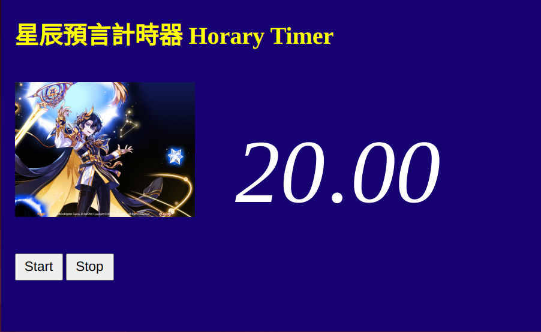

# 艾爾之光 宙月天星 星辰預言計時器 Elsword Cel Horary Timer

## 描述 Description
- 由於星辰預言會根據不同的時間點發動而有不同的效果 為了方便 此計時器可以告訴你當下是哪個效果 且剩餘時間還有多少
- Because the effect of Horary differs based on the timing you use the skill, for convenience, this timer can tell you what the current effect is and the remaining time before change to next effect

## 星辰預言狀態 States of Horary
- 每分鐘循環: **光線蒐集** 20秒(友軍所有傷害增加12% 持續時間10秒) -> **月亮空亡** 20秒(技能變更為連打型態且無視防禦狀態及無視防禦力100%) 
-> **審判** 15秒(友軍不會消耗特殊資源 持續時間8秒) -> **未知** 5秒(友軍所有傷害增加18％ 不會消耗特殊資源 持續時間15秒)
- Cycle per minute: **Colletion of Light**, 20 sec (Ally all damage increase 12% for 10 sec) -> **Void of Curse**, 20 sec (Change skill format with defense ignore 100% and guard ignore)
-> **Judgement**, 15 sec (Ally won't consume special resources for 8 sec) -> **Culmination**, 5 sec (Ally all damage increase 18% and won't consume special resources, for 15 sec)

## 如何使用 Usage
- 中文教學
  - 用瀏覽器打開**main.html**即可使用 (確保瀏覽器版本能支援**ES6 JavaScript**即可)
  - (非必要) 建議獨自開一個視窗 不要跟其他你需要用到的分頁放在一起
  - 按下**Start**即可開始計時 **Pause**暫停 **Stop**會重置回初始狀態
  - 只要在遊戲副本進場的時候按一下**Start** 然後離開副本後按一下**Stop**即可
  - 進入**未知**的時候 顯示的文字會變成黃字 作為提醒 (之後也許會再調整)

- English instruction
  - Open **main.html** with your browser (Please ensure the version of browser can support **ES6 JavaScript**)
  - (Optional) I recommend to open with an independent browser window, do not share a window with other tabs you need
  - Click **Start** to start timer, **Pause** to pause timer, and **Stop** will reset the timer
  - Just click **Start** when you enter the dungeon and click **Stop** after leaving dungeon
  - When the state is **Culmination**, the state text color will become yellow as reminder (but maybe I will adjust the way to remind)
